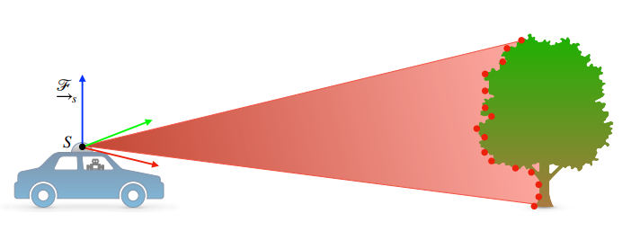

# Assignment 2

# Instructions

- This assignment is designed to get you familiar with handling Point Cloud Registration and Occupancy Grid construction
- This is a **two part assignment**, Assignment 2.1 and Assignment 2.2
    - **Assignment 2.1 will be released on the 5th of September 2020**
    - **Assignment 2.2 will be released on the 8th of September 2020**
- The **deadline** for both parts of the Assignment are **16th of September 2020**.
- Code must be written in Python only
- Ensure your code is modular since you will be reusing it for future assignments
- Submit your code files and report as a zipped file on Moodle, along with regular commits on GitHub classrooms
- The report should include all outputs and results and a description of your approach. It should also briefly describe what each member worked on
- The scoring will primarily be based on the completeness of your working code, completeness of your report, and the quality of your results
- Refer to the late day policy and plagiarism policy in the course information document
- Start early! This assignment may take fairly long to complete.

# Assignment 2.1 - Point Cloud Registration

## Point Clouds

Point clouds are a collection of points that represent a 3D shape or feature. Each point has its own set of X, Y and Z coordinates and in some cases additional attributes. We can think about a point cloud as a collection of multiple points, however, that would be oversimplifying things. Surprisingly, when many points are brought together they start to show some interesting qualities of the feature that they represent.

Point clouds are most often created by methods used in photogrammetry or remote sensing. Photogrammetry uses photographs to survey and measure an area or object. A combination of photographs taken at many angles can be used to create point clouds.

Point cloud of a KITTI Scene

Images of the point cloud taken from different views

## LIDAR Point Clouds

Basically, LiDAR is a remote sensing process which collects measurements used to create 3D models and maps of objects and environments. Using ultraviolet, visible, or near-infrared light, LiDAR gauges spatial relationships and shapes by measuring the time it takes for signals to bounce off objects and return to the scanner.

Although now most sources treat the word "LiDAR" as an acronym, the term originated as a combination of "light" and "radar". When LiDAR was first proposed in the 1960s, lasers and detection mechanisms were bulky and slow to operate — all that is changing rapidly.

LiDAR systems send out pulses of light just outside the visible spectrum and register how long it takes each pulse to return. The direction and distance of whatever the pulse hits are recorded as a point of data. Different LiDAR units have different methods, but generally they sweep in a circle like a RADAR dish, while simultaneously moving the laser up and down.

## Task 1 - Point Cloud Registration

**The task for this part of the Assignment is to register 77 point clouds given the global poses for each of them. You have to rotate and translate each point cloud according to the pose given, append them and finally plot them.**

1. The Dataset is a subset from the first sequence of the Kitti odometry evaluation [dataset](http://www.cvlibs.net/datasets/kitti/eval_odometry.php). This subset is from the odometry [dataset](http://www.cvlibs.net/download.php?file=data_odometry_velodyne.zip) sub-sequence 01.
2. The lidar scans are available in the folder “bins”. They are labeled 000000.bin, 000001.bin and so on. There are in total 77 such bin files.
3. Each of the xxxxxx.bin files contain the 3d point cloud captured by the LIDAR (format x,y,z,reflectance) at the xxxxxxth timestep.
4. 01.txt contains the poses for each of the timesteps in the format of a N x 12 table. If taken in the row major order you get the 3x4 transformation matrix.

Done correctly your output should look similar to this

### Frequently Asked Questions

- I am confused about which direction x y and z are also are the poses in the camera frame?

You can see how the LiDAR was mounted on the car. All the points are with respect to the LiDAR (in LiDAR's Frame). All the poses are in the Video Camera frame. Though not transforming them into the video camera frame will not yield any difference visually.

- Can I down sample the point cloud?

**Yes**. In fact you should do so. Velodyne HDL-64E generates around 2.2 Million Points per Second and you are doing this for approximately 7.7 seconds so please down sample (unless you have 64 gigs of ram).

- How do I visualize this? Matplotlib is hanging when I try to plot so many 3d points.

Use Open3d to visualize this.

# Assignment 2.2 - Occupancy Grid Construction

## Occupancy Grid Construction

### What are Occupancy Grid Maps?
Occupancy grid maps are discrete fine grain grid maps. These maps can be either 2-D or 3-D. Each cell in the occupancy grid map contains information on the physical objects present in the corresponding space. Since these maps shed light on what parts of the environment are occupied, and what is not, they are really useful for path planning and navigation.

Examples of a simple 2-D grid map and a complicated 3-D map. Notice how the 3-D map is discretized and not an example of a point cloud:

[https://lh4.googleusercontent.com/NxQOmkaI0iA1cWQo4ymdeprJyhMEKdyYlUyoNQa2AIxu5OY1YZ-LXoX-KeBoS-T-R7AO0zlBI0Byd_g24exM35H1vZj3mqv9-AUVfyr9J1D9CO1WSyiMXJ1Myu9cDLl3ihQqDQgF](https://lh4.googleusercontent.com/NxQOmkaI0iA1cWQo4ymdeprJyhMEKdyYlUyoNQa2AIxu5OY1YZ-LXoX-KeBoS-T-R7AO0zlBI0Byd_g24exM35H1vZj3mqv9-AUVfyr9J1D9CO1WSyiMXJ1Myu9cDLl3ihQqDQgF)

[https://lh3.googleusercontent.com/j47FR-uFXfsP3LWv5XQRyVLM6yk7EQiaKMGPEJCESA3UasHryl9a8ECjSsGgnGwfGJDUSmpH9IQpH8xn31_Xw_oohQZr15NUSSab3xR9TdGf5xK8Uc3TYIv9lHmbajspFZJOWIbl](https://lh3.googleusercontent.com/j47FR-uFXfsP3LWv5XQRyVLM6yk7EQiaKMGPEJCESA3UasHryl9a8ECjSsGgnGwfGJDUSmpH9IQpH8xn31_Xw_oohQZr15NUSSab3xR9TdGf5xK8Uc3TYIv9lHmbajspFZJOWIbl)

Occupancy grid maps are probabilistic in nature due to noisy measurements. Each cell can have three states: Occupied, unoccupied, and unknown. For the purpose of this assignment, you can ignore the unknown and work in a binary setting where 1 is occupied and 0 is unoccupied

## Task 2 -  Occupancy Map Construction

1. **Create an occupancy grid map for each LiDAR scan. For the purpose of this assignment, you do not need to apply bayesian update rules and each individual scan can be assumed as a prior. Save each scan as a binary png**
2. **Using odometry data, concat multiple scans and create a occupancy grid of 5, 10 and 15 scans**

**Tip: You can mark a cell as occupied based on a threshold of how many different z values are there for a particular (x,y) cell.**

Results should look something like this:

